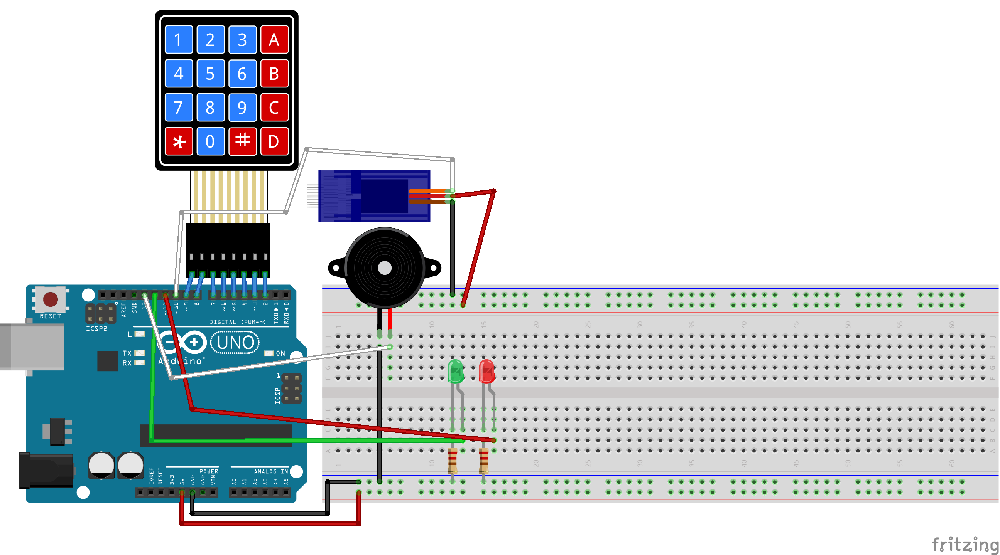

# Embedded Access Control System

A microcontroller-based authentication system implementing secure access control using a 4x4 matrix keypad and servo-actuated locking mechanism. Built on Arduino platform with real-time input validation and multi-modal user feedback.

---

## Overview

This embedded system demonstrates hardware-software integration for IoT security applications. The system validates user credentials through keypad input, controls physical access via servo actuation, and provides real-time feedback through visual and audible indicators.

---

## Core Features

* **Password Authentication** - 4-digit PIN validation with input buffering
* **Matrix Keypad Interface** - 4x4 membrane keypad with debouncing and key scanning
* **Servo Actuation Control** - PWM-based motor control for lock mechanism
* **Multi-Modal Feedback** - LED status indicators and piezo buzzer alerts
* **State Machine Logic** - Automatic timeout and lock reset functionality
* **Real-Time Processing** - Event-driven architecture with non-blocking I/O

---

## Hardware Architecture

| Component | Function | Interface |
|-----------|----------|-----------|
| Elegoo UNO R3 (ATmega328P) | Main MCU | - |
| 4x4 Membrane Keypad | User input device | GPIO matrix scanning |
| SG90 Micro Servo | Lock actuator | PWM (Pin 10) |
| Red LED | Denial indicator | Digital output |
| Green LED | Grant indicator | Digital output |
| Piezo Buzzer | Audible alarm | Digital output |

---

## Wiring Diagram



---

## System Operation

1. User enters PIN via keypad (`*` to clear, `#` to submit)
2. Firmware validates input against stored credential
3. **Access Granted**: Servo rotates 90° (unlock) → 5s delay → returns to 0° (lock)
4. **Access Denied**: Red LED + buzzer activation for 3s

---

## Technical Skills Demonstrated

* **Embedded Systems Programming** - Bare-metal C++ on AVR architecture
* **Hardware Interfacing** - GPIO, PWM, and peripheral driver implementation
* **Input Validation** - String parsing and authentication logic
* **State Management** - Event-driven firmware with timing control
* **Security Concepts** - Basic authentication and access control implementation
* **Circuit Design** - Component integration and pin assignment

---

## Getting Started

### Prerequisites

* Arduino IDE 1.8+ or PlatformIO
* Keypad library (`Keypad.h`)
* Servo library (`Servo.h`)

---

### Installation

1. Clone this directory:
```bash
git clone https://github.com/gavinomtz/embedded-systems-projects/tree/main/access-control-system
cd access-control-system
```

2. Open the `.ino` file in Arduino IDE

3. Install required libraries via Library Manager

4. Upload to your Arduino UNO R3

---

### Pin Configuration

| Pin | Component |
|-----|-----------|
| 2-5 | Keypad columns |
| 6-9 | Keypad rows |
| 10 | Servo signal |
| 11 | Red LED |
| 12 | Green LED |
| 13 | Buzzer |

---

### Default Credentials

* **Default PIN**: `1234`
* To change: modify `password` variable in code

---

## Usage

1. Power on the system
2. Enter your 4-digit PIN using the keypad
3. Press `#` to submit
4. Press `*` to clear input and start over

---

## Development Environment

* **Platform**: Arduino IDE / PlatformIO
* **Language**: C++ (Arduino framework)
* **Libraries**: Keypad.h, Servo.h
* **MCU**: ATmega328P (16MHz)

---

## License

This project is open source and available under the [MIT License](LICENSE).

---

## Author

**Gavino Martinez**
- GitHub: [@gavinomtz](https://github.com/gavinomtz)
- LinkedIn: [Gavino Martinez](https://www.linkedin.com/in/gavinomartinez/)

---

## Acknowledgments

* Arduino community for hardware abstraction libraries
* Elegoo for accessible development hardware