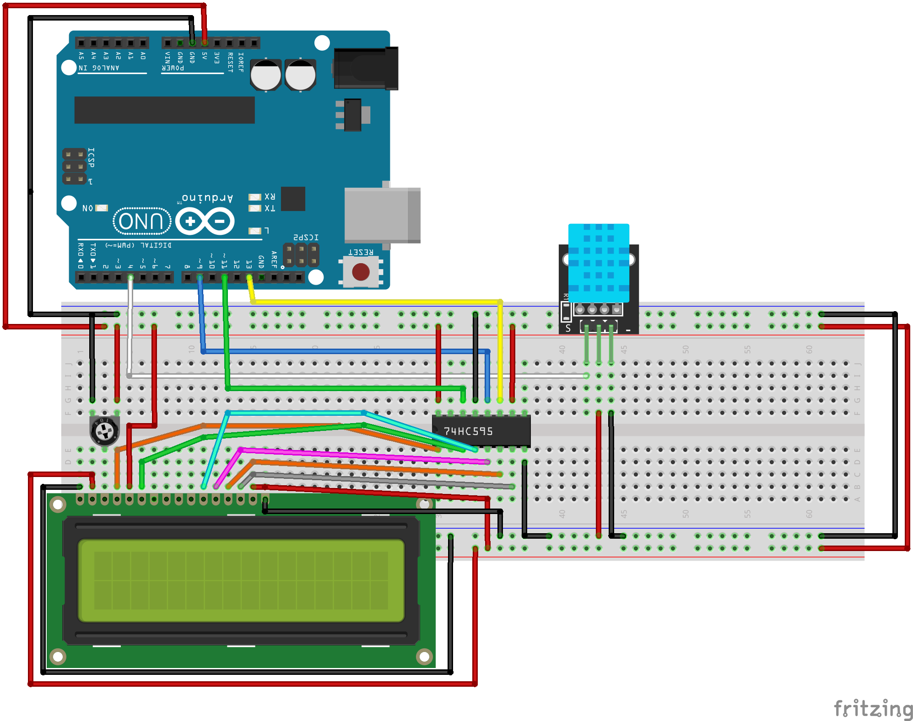

# Shift Register LCD Environmental Display (DHT11 + 74HC595)

This project reads temperature and humidity from a DHT11 sensor and displays the values on a 16x2 LCD using a single‐wire 74HC595 shift register interface.  
This reduces digital I/O pin usage and demonstrates efficient display driving for embedded systems.

---

## Features

- DHT11 temperature + humidity measurement
- LCD driven through 74HC595 shift register (ShiftedLCD library)
- 16x2 real‐time environmental data readout
- Minimal pin usage compared to standard parallel LCD control

---

## Hardware Used

| Component | Purpose |
|----------|----------|
| Elegoo UNO R3 | main MCU |
| DHT11 sensor | humidity + temperature sensing |
| 74HC595 shift register | serial-to-parallel LCD control |
| 16x2 LCD (HD44780 compatible) | visual display output |
| Jumper wires / breadboard | general wiring |

---

## Wiring Diagram

---

## Library Dependencies

| Library | Purpose |
|--------|---------|
| `ShiftedLCD.h` | LCD via 74HC595 |
| `DHT.h` | DHT11 sensor driver |

---

## Code Behavior (Summary)

1. MCU reads humidity + temperature
2. LCD updates every ~2 seconds
3. Data printed in Celsius in a human‐readable format:
Temp: XX.X C
Humid: YY.Y %

---

## Skills Demonstrated

- 8‐bit shift register display control
- embedded sensor data acquisition
- SPI/serial to parallel peripheral control
- real-time UI output on a microcontroller
- reduced pin usage hardware optimization

---
