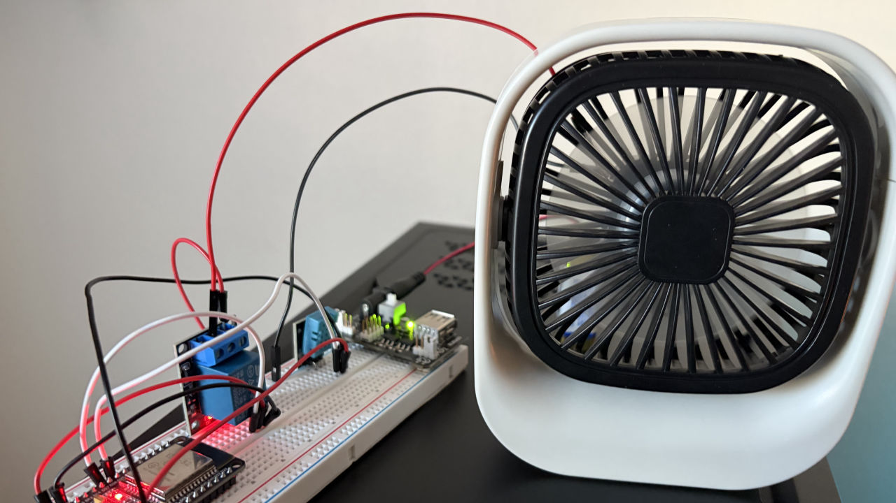

# Autonomous Thermal Control System


IoT-enabled autonomous environmental control system with real-time web dashboard. Built to solve a real problem (overheating AV equipment) while demonstrating embedded systems, wireless communication, and full-stack IoT development principles.

## 🎯 Project Overview

This system autonomously monitors ambient temperature via DHT11 sensor and controls a cooling fan through relay actuation—all while providing remote access through a WiFi-enabled web dashboard. The ESP32 makes real-time control decisions at the edge while maintaining cloud connectivity for data monitoring and manual override.

**Real-World Context:** My AV receiver was overheating in its TV stand enclosure. Instead of just adding a fan, I built an intelligent system that demonstrates autonomous control, wireless telemetry, and human-in-the-loop override capabilities—principles directly applicable to defense systems, unmanned vehicles, and distributed sensor networks.

## ✨ Key Features

### Autonomous Operation
- **Threshold-Based Control** - Automatic fan activation at configurable temperature setpoint
- **Hysteresis Logic** - 1°C dead-band prevents rapid on/off cycling and extends hardware life
- **Edge Computing** - Real-time decisions made locally without cloud dependency
- **Manual Override** - Remote control capability via web interface for testing or emergency response
- **Graceful Degradation** - System maintains last known state if sensor fails

### IoT Connectivity & Monitoring
- **WiFi Web Dashboard** - Full-featured control interface accessible from any device on network
- **Live Data Streaming** - 2-second update rate with Chart.js visualization
- **Historical Graphs** - Rolling 2-minute temperature trend display
- **Remote Control** - Turn fan on/off or toggle automatic mode from anywhere
- **Dynamic Settings** - Adjust temperature threshold without re-programming
- **System Telemetry** - Uptime tracking, connection status, operating mode indicators

### Hardware Integration
- **ESP32 Dual-Core** - Concurrent WiFi communication and real-time control
- **DHT11 Sensor** - Temperature and humidity monitoring with ±2°C accuracy
- **Relay Module** - Isolated 10A switching for AC/DC loads
- **USB Desk Fan** - 5V DC cooling actuator (easily replaceable with larger fans)

## 🛠️ Hardware Architecture

### Components & Specifications

| Component | Function | Interface | Cost |
|-----------|----------|-----------|------|
| ESP32 DevKit (30-pin) | Main controller + WiFi | - | ~$10 |
| DHT11 Temperature Sensor | Environmental monitoring | 1-wire digital (GPIO 25) | ~$3 |
| 5V Relay Module | Load switching | GPIO 26 (active HIGH) | ~$3 |
| USB Desk Fan (5V DC) | Cooling actuator | Relay-switched power | ~$10 |
| Jumper Wires | Interconnection | - | ~$5 |
| Breadboard | Prototyping | - | ~$5 |

**Total Project Cost:** ~$36

### Pin Configuration

```
DHT11 Sensor:
  VCC  → ESP32 3.3V (or 5V if needed for power)
  DATA → GPIO 25
  GND  → ESP32 GND

Relay Module:
  VCC → ESP32 VIN (5V)
  IN  → GPIO 26
  GND → ESP32 GND

Fan Power (through relay):
  USB Fan (+) → Relay COM terminal
  Relay NO → ESP32 VIN or external 5V supply
  USB Fan (-) → ESP32 GND
```

### System Architecture

```
┌───────────────────────────────────────────────────────┐
│         IoT Autonomous Control System                 │
│                                                        │
│  ┌──────────┐      ┌──────────────┐      ┌──────┐   │
│  │  DHT11   │─────▶│    ESP32     │─────▶│Relay │   │
│  │  Sensor  │      │  Dual-Core   │      │Module│   │
│  └──────────┘      │  + WiFi      │      └──┬───┘   │
│                    └───────┬──────┘         │        │
│                            │                 ▼        │
│                            │             ┌──────┐    │
│                            │             │ Fan  │    │
│                            ▼             │ 5V DC│    │
│                       ┌─────────┐       └──────┘    │
│                       │  WiFi   │                    │
│                       │Web Server│                   │
│                       └────┬────┘                    │
│                            │                         │
│                            ▼                         │
│                   ┌────────────────┐                │
│                   │ Web Dashboard  │                │
│                   │ (Any Browser)  │                │
│                   └────────────────┘                │
└───────────────────────────────────────────────────────┘
```

## 💻 Control Algorithm

### Hysteresis-Based Threshold Control

```cpp
// Autonomous control loop (runs every 2 seconds)
if (currentTemp >= TEMP_THRESHOLD && !fanOn) {
    activate_fan();  // Turn on at threshold
}
else if (currentTemp < (TEMP_THRESHOLD - HYSTERESIS) && fanOn) {
    deactivate_fan();  // Turn off 1°C below threshold
}
```

**Parameters:**
- **Threshold**: 22.0°C (configurable via web interface)
- **Hysteresis**: 1.0°C (prevents oscillation)
- **Update Rate**: 2 seconds (sensor polling + display refresh)
- **Data Retention**: 60 readings (2 minutes of history)

### Operating Modes

**Automatic Mode** (Default):
- System makes all control decisions based on temperature
- Fan activates at threshold, deactivates at threshold - hysteresis
- Ideal for "set it and forget it" operation

**Manual Mode**:
- User control via web interface overrides autonomous logic
- ON/OFF buttons for direct fan control
- Useful for testing, maintenance, or forcing cooling
- Remains in manual until "Auto Mode" button clicked

## 🌐 Web Dashboard

### Real-Time Monitoring
- **Live Temperature Display** - Large, easy-to-read current temperature
- **Humidity Tracking** - Ambient moisture percentage
- **Fan Status Indicator** - Visual ON/OFF with animated spinning icon
- **Operating Mode Badge** - Automatic vs Manual indication
- **System Uptime** - Hours:Minutes:Seconds since boot
- **Connection Status** - Real-time WebSocket-style updates

### Interactive Controls
- **Manual Override** - Force fan ON/OFF for testing
- **Auto Mode Toggle** - Return to autonomous operation
- **Threshold Adjustment** - Slider control (18-35°C range)
- **Instant Feedback** - Control actions reflected within 200ms

### Data Visualization
- **Temperature Graph** - Chart.js line chart showing last 60 readings
- **Trend Analysis** - Visual identification of heating/cooling patterns
- **Responsive Design** - Works seamlessly on desktop, tablet, and mobile

### Professional UI
- **Modern Glassmorphic Design** - Gradient background with frosted glass cards
- **Color-Coded Status** - Green (ON/cooling), Red (OFF), Blue (Auto mode)
- **Smooth Animations** - Spinning fan icon, hover effects, transitions
- **Mobile-Optimized** - Touch-friendly controls, responsive grid layout

## 🚀 Getting Started

### Prerequisites

**Software:**
- Arduino IDE 1.8.13+ or PlatformIO
- ESP32 board support package
- Required libraries:
  - `DHT sensor library` by Adafruit
  - WiFi (built-in to ESP32 core)
  - WebServer (built-in to ESP32 core)

**Hardware:**
- ESP32 development board with WiFi
- WiFi network (Most ESP32's don't support 5GHz)
- USB cable for programming
- 5V power supply (USB adapter or computer)

### Installation Steps

#### 1. Install ESP32 Board Support

**Arduino IDE:**
```
File → Preferences → Additional Board Manager URLs
Add: https://dl.espressif.com/dl/package_esp32_index.json
Tools → Board → Boards Manager → Search "ESP32" → Install
```

**PlatformIO:**
```ini
[env:esp32doit-devkit-v1]
platform = espressif32
board = esp32doit-devkit-v1
framework = arduino
```

#### 2. Install Required Libraries

**Arduino IDE:**
```
Tools → Manage Libraries
Search and install:
  - "DHT sensor library" by Adafruit
  - "Adafruit Unified Sensor" (dependency)
```

**PlatformIO:**
```ini
lib_deps = 
    adafruit/DHT sensor library
    adafruit/Adafruit Unified Sensor
```

#### 3. Clone Repository

```bash
git clone https://github.com/gavinomtz/embedded-systems-projects/tree/main/iot-autonomous-thermal-control.git
cd iot-autonomous-thermal-control
```

#### 4. Configure WiFi Credentials

Update:

```cpp
const char* ssid = "notleakingmyIP";      // Your network name
const char* password = "notleakingmyPassword";  // Your password
```

⚠️ **Note:** Make sure you're connecting to the right network. Most ESP32's don't support 5GHz WiFi.

#### 5. Wire Hardware

Follow the pin configuration diagram above. Key connections:
- DHT11 DATA → GPIO 25
- Relay IN → GPIO 26

#### 6. Upload Code

```
1. Connect ESP32 via USB
2. Select Board: "ESP32 Dev Module"
3. Select Port: (your COM/tty port)
4. Click Upload
5. Open Serial Monitor (115200 baud)
6. Wait for "WiFi Connected!" message
7. Note the IP address displayed
```

#### 7. Access Dashboard

```
1. Open web browser (Chrome/Firefox/Safari)
2. Navigate to: http://192.168.1.XXX (ESP32's IP from step 6)
3. Dashboard loads automatically
4. Test manual controls to verify connectivity
```

## 🧪 Testing & Calibration

### Initial System Validation

**Power-On Self Test:**
1. Verify Serial Monitor shows:
   - "WiFi Connected!"
   - IP address assigned
   - Temperature readings (not NaN)
   - "System ready!"

2. Check dashboard loads:
   - Temperature displays correctly
   - Humidity shows valid percentage
   - Fan icon visible (not spinning initially)
   - Connection status: "Connected"

**Sensor Verification:**
```cpp
// Expected Serial Monitor output:
Temp: 23.5C | Humid: 45.2% | Fan: OFF
Temp: 23.6C | Humid: 45.1% | Fan: OFF
```

### Calibration Procedure

**Step 1: Determine Baseline Temperature**
- Let system run for 5 minutes to stabilize
- Note the average room temperature
- This is your baseline

**Step 2: Set Appropriate Threshold**
- For testing: Set threshold 2-3°C above baseline
- For production: Set to personal comfort level (typically 24-28°C)
- Adjust via web dashboard slider

**Step 3: Test Autonomous Activation**
1. Set threshold to current temp + 2°C
2. Gently warm DHT11 with hands (don't touch sensor directly)
3. Watch Serial Monitor:
   ```
   Temp: 24.5C | Humid: 45% | Fan: OFF
   Temp: 25.1C | Humid: 45% | Fan: OFF
   >>> FAN TURNED ON (AUTO) <<<
   Temp: 25.3C | Humid: 44% | Fan: ON
   ```
4. Remove heat source, verify fan turns off when temp drops

**Step 4: Test Manual Override**
1. Click "Turn ON" button → Fan should start immediately
2. Verify "Mode: MANUAL" badge appears
3. Click "Turn OFF" → Fan should stop
4. Click "Auto Mode" → System returns to autonomous control

**Step 5: Verify Hysteresis**
- With threshold at 26°C, fan should:
  - Turn ON at 26.0°C
  - Turn OFF at 25.0°C (26 - 1°C hysteresis)
- Should NOT rapidly cycle on/off

### Validation Checklist

- [ ] ESP32 connects to WiFi successfully
- [ ] Dashboard accessible from multiple devices
- [ ] Temperature readings update every 2 seconds
- [ ] Graph populates and scrolls correctly
- [ ] Manual ON/OFF controls work immediately
- [ ] Auto mode activates/deactivates fan at threshold
- [ ] Hysteresis prevents rapid cycling
- [ ] System recovers gracefully if sensor temporarily fails
- [ ] Uptime counter increments correctly
- [ ] Threshold adjustment via slider takes effect

## 🎓 Skills Demonstrated

### Embedded Systems Engineering
- **Real-Time Control** - Continuous sensor polling with deterministic response
- **State Machine Design** - Clean control flow with well-defined operating modes
- **Peripheral Integration** - GPIO, ADC, and WiFi hardware abstraction
- **Resource Management** - Memory-efficient data logging with circular buffers
- **Error Handling** - Sensor validation and fail-safe behavior

### IoT Architecture
- **Edge Computing** - Autonomous decision-making without cloud dependency
- **WiFi Connectivity** - ESP32 network stack configuration and management
- **Web Server Implementation** - HTTP server running on microcontroller
- **RESTful API Design** - Clean endpoint architecture for data and control
- **Real-Time Communication** - Live data streaming with 2-second refresh

### Full-Stack Development
- **Frontend** - Responsive HTML/CSS/JavaScript dashboard
- **Data Visualization** - Chart.js integration for real-time graphing
- **UI/UX Design** - Modern, intuitive interface with visual feedback
- **Asynchronous Communication** - Fetch API for non-blocking requests

### Control Systems Theory
- **Hysteresis Control** - Dead-band implementation to prevent oscillation
- **Threshold-Based Actuation** - Binary control with configurable setpoint
- **System Stability** - Preventing chattering and extending actuator lifetime
- **Manual Override Architecture** - Human-in-the-loop control capability

### Industry Relevant Skills
- **Autonomous Operation** - No human intervention required
- **Remote Monitoring** - Telemetry and control from distance
- **Sensor Integration** - Environmental data acquisition
- **Thermal Management** - Critical for electronics in harsh environments
- **Fail-Safe Design** - Graceful degradation
- **Edge + Cloud Architecture** - Distributed computing

## 🔮 Future Enhancements

### Phase 2: Advanced Control
- [ ] **Proportional PWM Fan Speed** - Variable speed control based on temperature delta
- [ ] **PID Control Implementation** - Precise temperature regulation with minimal overshoot
- [ ] **Multi-Zone Temperature Sensing** - Array of DHT sensors for spatial monitoring
- [ ] **Predictive Cooling Algorithm** - Anticipate temperature rise based on rate of change
- [ ] **Adaptive Learning** - ML-based pattern recognition for usage optimization

### Phase 3: Extended IoT Features
- [ ] **Cloud Data Logging** - Firebase/ThingSpeak integration for long-term trends
- [ ] **MQTT Protocol** - Pub/sub messaging for Home Assistant integration
- [ ] **Email/SMS Alerts** - Notifications for temperature threshold violations
- [ ] **Mobile App** - Native iOS/Android companion app
- [ ] **Voice Control** - Alexa/Google Home integration
- [ ] **OTA Updates** - Wireless firmware updates without USB connection

### Phase 4: Production Features
- [ ] **Custom PCB Design** - Replace breadboard with professional board layout
- [ ] **3D-Printed Enclosure** - Compact, mountable housing with ventilation
- [ ] **Battery Backup** - Uninterruptpted operation during power loss
- [ ] **SD Card Logging** - Local long-term data storage with CSV export
- [ ] **Capacitive Touch Interface** - Local configuration without web access
- [ ] **Multiple Fan Control** - Independent zones with separate actuators

### Phase 5: Security Hardening
- [ ] **WPA2-Enterprise** - Certificate-based WiFi authentication
- [ ] **TLS/HTTPS** - Encrypted web dashboard communication
- [ ] **API Authentication** - JWT tokens for control endpoint access
- [ ] **Secure Boot** - Firmware integrity verification
- [ ] **Encrypted Flash** - Protect credentials in non-volatile storage

## 📊 Performance Metrics

| Metric | Value | Notes |
|--------|-------|-------|
| **Temperature Accuracy** | ±2°C | DHT11 specification |
| **Humidity Accuracy** | ±5% RH | DHT11 specification |
| **Control Loop Frequency** | 0.5 Hz | 2-second polling interval |
| **Response Time** | <5 seconds | Threshold crossing to actuation |
| **WiFi Connection Time** | 5-10 seconds | Network-dependent |
| **Dashboard Latency** | <100ms | On local network |
| **Data Update Rate** | 2 seconds | Real-time refresh |
| **Historical Data** | 2 minutes | 60 readings in RAM |
| **Power Consumption (Idle)** | ~120mA @ 5V | ESP32 + sensor |
| **Power Consumption (Active)** | ~150mA @ 5V | Plus fan load (200-400mA) |
| **WiFi Range** | ~50m indoor | 2.4GHz typical |
| **Concurrent Users** | 5+ simultaneous | Limited by ESP32 memory |

## 🔧 Troubleshooting

### WiFi Connection Issues

**Problem: ESP32 won't connect to WiFi**

**Diagnostics:**
```cpp
// Serial Monitor shows:
Connecting to WiFi..........
WiFi Failed!
```

**Solutions:**
1. Verify SSID and password are correct (case-sensitive)
2. Change network to 2.4GHz (Most ESP32's don't support 5GHz)
3. Check router allows new device connections (not at DHCP limit)
4. Move ESP32 closer to router (weak signal)
5. Try different WiFi channel (interference)

**Advanced Debug:**
```cpp
// Add to connectWiFi() function:
Serial.print("WiFi Status Code: ");
Serial.println(WiFi.status());
// 0 = WL_IDLE_STATUS
// 1 = WL_NO_SSID_AVAIL (can't find network)
// 3 = WL_CONNECTED (success)
// 4 = WL_CONNECT_FAILED (wrong password)
```

---

**Problem: Connected but can't access dashboard**

**Diagnostics:**
- ESP32 has IP address
- Dashboard won't load in browser

**Solutions:**
1. Verify device on same WiFi network as ESP32
2. Disable VPN if enabled
3. Try different browser (Chrome recommended)
4. Check firewall not blocking port 80
5. Try pinging ESP32: `ping 192.168.1.XXX`

### Sensor Issues

**Problem: Temperature shows 0.0°C or NaN**

**Diagnostics:**
```cpp
// Serial Monitor shows:
Temp: 0.0C | Humid: 0.0% | Fan: OFF
// or
⚠️ Sensor read failed - using last known values
```

**Solutions:**
1. Check wiring - verify DATA pin on GPIO 25
2. Ensure VCC connected to 3.3V or 5V
3. Verify GND connection
4. Try adding 10kΩ pull-up resistor between DATA and VCC
5. Replace sensor (may be defective)
6. Verify it's DHT11 not DHT22 in code

**Hardware Test:**
```cpp
// Upload simple test sketch:
#include <DHT.h>
#define DHTPIN 25
#define DHTTYPE DHT11
DHT dht(DHTPIN, DHTTYPE);

void setup() {
  Serial.begin(115200);
  dht.begin();
  delay(2000);
}

void loop() {
  float t = dht.readTemperature();
  Serial.print("Temp: ");
  Serial.println(t);
  delay(2000);
}
```

---

**Problem: Temperature readings fluctuate wildly**

**Solutions:**
1. Move sensor away from fan airflow
2. Increase polling interval (reduce noise)
3. Implement moving average filter
4. Check for electromagnetic interference
5. Ensure sensor not in direct sunlight

### Fan Control Issues

**Problem: Relay clicks but fan doesn't run**

**Diagnostics:**
- Relay audibly clicks
- Fan doesn't spin

**Solutions:**
1. Verify fan requires 5V (not 12V)
2. Check relay NO (Normally Open) terminal used
3. Test fan directly with 5V to confirm functional
4. Ensure adequate power supply current (2A+ recommended)
5. Check USB cable quality (voltage drop)
6. Verify fan polarity correct

---

**Problem: Fan runs constantly regardless of temperature**

**Diagnostics:**
- Fan always ON even when cold
- Manual controls don't work

**Solutions:**
1. Check relay wiring - may be on NC (Normally Closed) instead of NO
2. Verify GPIO 26 pin number correct
3. Check if manual override stuck enabled
4. Look for code upload errors
5. Try power cycling ESP32

### Dashboard Issues

**Problem: Controls work but data shows "--" or old values**

**Diagnostics:**
- Buttons respond
- Temperature/humidity not updating

**Solutions:**
1. Open browser console (F12) - check for JavaScript errors
2. Verify `/data` endpoint returns valid JSON:
   - Visit `http://ESP32_IP/data` directly
   - Should see: `{"temp":23.5,"humidity":45.2,...}`
3. Check Serial Monitor for sensor read errors
4. Clear browser cache (Ctrl+Shift+Delete)
5. Try incognito/private browsing mode

---

**Problem: Dashboard loads but chart doesn't display**

**Solutions:**
1. Check Chart.js loaded (visit without internet to test CDN)
2. Verify history array has data
3. Open browser console for errors
4. Try refreshing page (F5)

### System Behavior Issues

**Problem: Fan rapidly cycles on/off**

**Cause:** Hysteresis too small or sensor in airflow

**Solutions:**
1. Increase HYSTERESIS constant to 2.0°C
2. Move sensor away from fan direct airflow
3. Increase update interval to 5 seconds
4. Add minimum runtime (don't allow OFF within 30s of ON)

---

**Problem: System crashes or resets randomly**

**Diagnostics:**
```cpp
// Serial Monitor shows:
Brownout detector was triggered
```

**Solutions:**
1. Use higher quality USB power supply (2A minimum)
2. Add 100µF capacitor near ESP32 VIN
3. Power fan from separate 5V supply
4. Check for loose wiring causing shorts
5. Verify relay coil current within ESP32 limits

## 🎯 Applications & Relevance

### Defense Technology

**Autonomous Systems:**
This project demonstrates core principles used in autonomous platforms:

- **Sensor-Based Decision Making** - Environmental awareness and autonomous response mirrors UAV/UGV mission execution
- **Remote Monitoring & Override** - Human-in-the-loop control capability essential for beyond-line-of-sight operations
- **Fail-Safe Design** - Graceful degradation principles applicable to safety-critical systems
- **Thermal Management** - Direct relevance to electronics cooling in harsh environments

### Industrial Automation

**Process Control:**
- PLC-style threshold-based control logic
- Hysteresis implementation for actuator protection
- Remote monitoring and manual override
- SCADA system fundamentals

**Energy Efficiency:**
- Demand-based cooling (only run when needed)
- Configurable setpoints for optimization
- Historical data for efficiency analysis
- Predictive maintenance via usage patterns

### Smart Home & IoT

**Home Automation:**
- HVAC control and optimization
- Multi-zone environmental management
- Integration with existing smart home platforms (future MQTT/Home Assistant)
- Voice control potential (Alexa/Google)

**Consumer Applications:**
- Server rack cooling
- Greenhouse climate control
- Pet enclosure temperature regulation
- Wine cellar/humidor management

## 📄 License

This project is open source and available under the [MIT License](LICENSE).

```
MIT License

Copyright (c) 2024 Gavino Martinez

Permission is hereby granted, free of charge, to any person obtaining a copy
of this software and associated documentation files (the "Software"), to deal
in the Software without restriction, including without limitation the rights
to use, copy, modify, merge, publish, distribute, sublicense, and/or sell
copies of the Software, and to permit persons to whom the Software is
furnished to do so, subject to the following conditions:

[Full MIT License text...]
```

## 👤 Author

**Gavino Martinez**

Electrical Engineering Student | IoT Developer | Autonomous Systems

Passionate about building intelligent systems that bridge the gap between hardware and software. Interested in applications at the intersection of embedded systems, real-time control, and defense technology.

- 🔗 GitHub: [@gavinomtz](https://github.com/gavinomtz)
- 💼 LinkedIn: [Gavino Martinez](https://linkedin.com/in/gavinomartinez)
- 📧 Email: gavinomtz@live.com

## 🙏 Acknowledgments

- **Espressif Systems** - ESP32 platform and comprehensive documentation
- **Adafruit Industries** - DHT sensor libraries and hardware support
- **Arduino Community** - Open-source embedded systems resources
- **Chart.js Team** - Data visualization library

## 🔗 Related Projects

Interested in similar work? Check out:
- [Embedded Systems Projects](../embedded-systems-projects) - Arduino-based control systems
- [Academic Project Portfolio](../academic-project-portfolio) - Coursework and lab projects

---

<div align="center">

**🚀 Built for Reliability • Designed for Autonomy • Engineered for Scale**

*Demonstrating IoT and embedded control principles for the next-generation*

## 📹 Demo Video

[](https://www.youtube.com/watch?v=nSN4-HamR48)

**[Watch Full Demo on YouTube](https://www.youtube.com/watch?v=nSN4-HamR48)**

</div>

---

## 📝 Version History

**v1.0.0** (Current)
- Initial release with full autonomous control
- WiFi web dashboard with real-time updates
- Manual override and threshold configuration
- Temperature history graphing
- DHT11 sensor integration
- Relay-based fan control

**Planned for v1.1.0:**
- PWM-based fan speed control
- Multiple sensor support
- MQTT protocol integration
- Email alert system

---

*This project was built to solve a real problem while demonstrating skills relevant to autonomous systems engineering. If you're working on similar challenges or want to discuss embedded systems, IoT architecture, or defense tech applications, let's connect!*